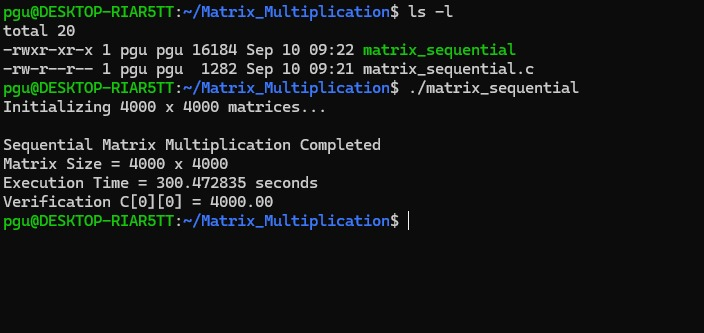
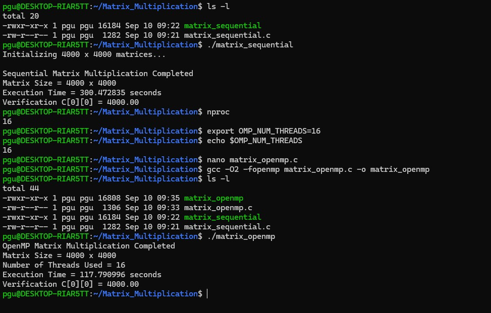
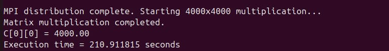

# Matrix Multiplication – Sequential, OpenMP, MPI and CUDA

## Objective

To implement and compare matrix multiplication using four different computing models:

1. Sequential CPU execution
2. OpenMP shared-memory parallelism
3. MPI distributed-memory parallelism
4. CUDA GPU parallelism

The same matrix multiplication problem is used for all implementations.

---

## Problem Definition

- Matrix A: 4000 × 4000
- Matrix B: 4000 × 4000
- All elements of A and B are initialized to `1.0`
- Operation: `C = A × B`

Since every element is 1.0 and each output element is calculated using 4000 multiplication terms:

```text
C[i][j] = 4000.00
````

Verification:

```text
C[0][0] = 4000.00
```

---

## Experiment Structure

```text
Experiment-1-Matrix-Multiplication/
│
├── matrix_sequential.c
├── matrix_sequential.jpeg
│
├── matrix_openmp.c
├── matrix_openmp.jpeg
│
├── matrix_mpi.c
├── matrix_cuda.cu
│
└── README.md
```

---

# 1. Sequential Matrix Multiplication

The sequential implementation performs matrix multiplication using a single CPU execution flow.

### Source File

```text
matrix_sequential.c
```

### Compilation

```bash
gcc -O2 matrix_sequential.c -o matrix_sequential
```

### Execution

```bash
./matrix_sequential
```

### Result

```text
Matrix Size = 4000 x 4000
Execution Time = 300.472835 seconds
Verification C[0][0] = 4000.00
```

### Recorded Time

**300.472835 seconds**

---

# 2. OpenMP Matrix Multiplication

OpenMP is used to parallelize the matrix multiplication across multiple CPU threads.

### Source File

```text
matrix_openmp.c
```

### Threads Used

```text
16 threads
```

### Compilation

```bash
gcc -O2 -fopenmp matrix_openmp.c -o matrix_openmp
```

### Execution

```bash
./matrix_openmp
```

### Result

```text
OpenMP Matrix Multiplication Completed
Matrix Size = 4000 x 4000
Number of Threads Used = 16
Execution Time = 117.790996 seconds
Verification C[0][0] = 4000.00
```

### Recorded Time

**117.790996 seconds**

---

# 3. MPI Distributed Matrix Multiplication

MPI is used to distribute the matrix multiplication across multiple MPI processes.

The implementation uses:

* `MPI_Scatter()` to distribute rows of matrix A
* `MPI_Bcast()` to distribute matrix B
* Local matrix multiplication on each MPI process
* `MPI_Gather()` to collect the partial results

### Source File

```text
matrix_mpi.c
```

### Matrix Size

```text
4000 × 4000
```

### MPI Processes

```text
4 processes
```

### Compilation

```bash
mpicc -O2 matrix_mpi.c -o matrix_mpi
```

### Execution

```bash
mpirun -np 4 ./matrix_mpi
```

### Result

```text
MPI distribution complete.
Starting 4000x4000 multiplication...

Matrix multiplication completed.
C[0][0] = 4000.00
Execution time = 210.911815 seconds
```

### Recorded Time

**210.911815 seconds**

---

# 4. CUDA Matrix Multiplication

CUDA is used to perform matrix multiplication on an NVIDIA GPU.

### Source File

```text
matrix_cuda.cu
```

### GPU

```text
NVIDIA GeForce RTX 5060 Ti
```

### CUDA Toolkit

```text
CUDA 13.4
```

### Matrix Size

```text
4000 × 4000
```

### Block Size

```text
16 × 16 threads
```

### Grid Size

```text
250 × 250 blocks
```

### Compilation

```powershell
nvcc -O2 matrix_cuda.cu -o matrix_cuda
```

### Execution

```powershell
matrix_cuda.exe
```

### Result

```text
Matrix Size: 4000 x 4000
Block Size: 16 x 16
Grid Size: 250 x 250
C[0][0] = 4000.00
Kernel time: 0.211245 seconds
```

### Recorded Kernel Time

**0.211245 seconds**

> Note: The CUDA value recorded here is the GPU kernel execution time. It should not be directly treated as the total end-to-end CUDA execution time.

---

# 5. Performance Results

The measured execution times from the experiments are:

| Implementation | Configuration                 | Execution Time |
| -------------- | ----------------------------- | -------------: |
| Sequential     | Single CPU execution          |   300.472835 s |
| OpenMP         | 16 CPU threads                |   117.790996 s |
| MPI            | 4 MPI processes               |   210.911815 s |
| CUDA           | RTX 5060 Ti, kernel execution |     0.211245 s |

All implementations produced the expected verification value:

```text
C[0][0] = 4000.00
```

---

## Speedup

Speedup can be calculated using:

```text
Speedup = Sequential Execution Time / Parallel Execution Time
```

For OpenMP:

```text
300.472835 / 117.790996 ≈ 2.55×
```

For MPI:

```text
300.472835 / 210.911815 ≈ 1.42×
```

For CUDA kernel time:

```text
300.472835 / 0.211245 ≈ 1422.87×
```

### Important Note

The implementations were executed in different environments/configurations. Therefore, these values demonstrate the observed execution times rather than a controlled hardware benchmark.

The CUDA measurement is specifically the **kernel execution time**, while the CPU and MPI measurements represent their respective measured execution intervals.

---

# 6. Technologies Used

* C
* GCC
* OpenMP
* MPI / Open MPI
* CUDA
* NVIDIA `nvcc`
* Linux / WSL
* Windows PowerShell
* VMware virtual machines for MPI

---

# 7. Learning Outcomes

This experiment demonstrates four approaches to parallel and high-performance computing:

### Sequential

Provides the baseline implementation and execution time.

### OpenMP

Demonstrates shared-memory parallelism using multiple CPU threads.

### MPI

Demonstrates distributed-memory parallelism using multiple processes and explicit communication.

### CUDA

Demonstrates GPU-based parallel computation using CUDA threads, blocks and grids.

---

# 8. Conclusion

The same 4000 × 4000 matrix multiplication problem was implemented using sequential execution, OpenMP, MPI and CUDA.

The experiment demonstrates how the same computational problem can be approached using:

```text
Sequential CPU
      ↓
OpenMP Shared Memory
      ↓
MPI Distributed Memory
      ↓
CUDA GPU Parallelism
```

The output verification remained consistent across the implementations:

```text
C[0][0] = 4000.00
```

The experiment provides practical understanding of CPU-based parallelism, distributed-memory computing and GPU acceleration.

````
---

# 9. Execution Screenshots

## Sequential Matrix Multiplication



## OpenMP Matrix Multiplication



## MPI Matrix Multiplication



## CUDA Matrix Multiplication


…
Yes bro — this is the README we should use, but I spotted a few things we should correct before committing it.

Important corrections
Actual CUDA file is matrix_cuda.c, not matrix_cuda.cu
Your copied repo contains:

matrix_cuda.c
So the project structure, source-file section, and compilation command need to match that.

The screenshot section is currently outside the main Markdown code block formatting you pasted. We'll make the final README clean Markdown.

Since your actual CUDA source contains CUDA code but has a .c extension, we should not silently rename the source file. For now, the README can document the actual filename and use:

nvcc -x cu -O2 matrix_cuda.c -o matrix_cuda
This explicitly tells nvcc to treat the .c file as CUDA source.

The performance numbers and the important CUDA-kernel-time qualification should stay exactly as you provided them.

Clean final README.md
Replace the current README with this:

# Matrix Multiplication – Sequential, OpenMP, MPI and CUDA

## Objective

To implement and compare matrix multiplication using four different computing models:

1. Sequential CPU execution
2. OpenMP shared-memory parallelism
3. MPI distributed-memory parallelism
4. CUDA GPU parallelism

The same matrix multiplication problem is used for all implementations.

---

## Problem Definition

- Matrix A: 4000 × 4000
- Matrix B: 4000 × 4000
- All elements of A and B are initialized to `1.0`
- Operation: `C = A × B`

Since every element is 1.0 and each output element is calculated using 4000 multiplication terms:

```text
C[i][j] = 4000.00
```

Verification:

```text
C[0][0] = 4000.00
```

---

## Experiment Structure

```text
Matrix-Multiplication/
│
├── README.md
│
├── matrix_sequential.c
├── matrix_sequential.jpeg
│
├── matrix_openmp.c
├── matrix_openmp.jpeg
│
├── matrix_mpi.c
├── matrix_mpi.jpeg
│
├── matrix_cuda.c
└── matrix_cuda.jpeg
```

---

# 1. Sequential Matrix Multiplication

The sequential implementation performs matrix multiplication using a single CPU execution flow.

### Source File

```text
matrix_sequential.c
```

### Compilation

```bash
gcc -O2 matrix_sequential.c -o matrix_sequential
```

### Execution

```bash
./matrix_sequential
```

### Result

```text
Matrix Size = 4000 x 4000
Execution Time = 300.472835 seconds
Verification C[0][0] = 4000.00
```

### Recorded Time

**300.472835 seconds**

---

# 2. OpenMP Matrix Multiplication

OpenMP is used to parallelize the matrix multiplication across multiple CPU threads.

### Source File

```text
matrix_openmp.c
```

### Threads Used

```text
16 threads
```

### Compilation

```bash
gcc -O2 -fopenmp matrix_openmp.c -o matrix_openmp
```

### Execution

```bash
./matrix_openmp
```

### Result

```text
OpenMP Matrix Multiplication Completed
Matrix Size = 4000 x 4000
Number of Threads Used = 16
Execution Time = 117.790996 seconds
Verification C[0][0] = 4000.00
```

### Recorded Time

**117.790996 seconds**

---

# 3. MPI Distributed Matrix Multiplication

MPI is used to distribute the matrix multiplication across multiple MPI processes.

The implementation uses:

- `MPI_Scatter()` to distribute rows of matrix A
- `MPI_Bcast()` to distribute matrix B
- Local matrix multiplication on each MPI process
- `MPI_Gather()` to collect the partial results

### Source File

```text
matrix_mpi.c
```

### Matrix Size

```text
4000 × 4000
```

### MPI Processes

```text
4 processes
```

### Compilation

```bash
mpicc -O2 matrix_mpi.c -o matrix_mpi
```

### Execution

```bash
mpirun -np 4 ./matrix_mpi
```

### Result

```text
MPI distribution complete.
Starting 4000x4000 multiplication...

Matrix multiplication completed.
C[0][0] = 4000.00
Execution time = 210.911815 seconds
```

### Recorded Time

**210.911815 seconds**

---

# 4. CUDA Matrix Multiplication

CUDA is used to perform matrix multiplication on an NVIDIA GPU.

### Source File

```text
matrix_cuda.c
```

### GPU

```text
NVIDIA GeForce RTX 5060 Ti
```

### CUDA Toolkit

```text
CUDA 13.4
```

### Matrix Size

```text
4000 × 4000
```

### Block Size

```text
16 × 16 threads
```

### Grid Size

```text
250 × 250 blocks
```

### Compilation

```powershell
nvcc -x cu -O2 matrix_cuda.c -o matrix_cuda
```

### Execution

```powershell
matrix_cuda.exe
```

### Result

```text
Matrix Size: 4000 x 4000
Block Size: 16 x 16
Grid Size: 250 x 250
C[0][0] = 4000.00
Kernel time: 0.211245 seconds
```

### Recorded Kernel Time

**0.211245 seconds**

> **Note:** The CUDA value recorded here is the GPU kernel execution time. It should not be directly treated as the total end-to-end CUDA execution time.

---

# 5. Performance Results

The measured execution times from the experiments are:

| Implementation | Configuration | Execution Time |
|---|---|---:|
| Sequential | Single CPU execution | 300.472835 s |
| OpenMP | 16 CPU threads | 117.790996 s |
| MPI | 4 MPI processes | 210.911815 s |
| CUDA | RTX 5060 Ti, kernel execution | 0.211245 s |

All implementations produced the expected verification value:

```text
C[0][0] = 4000.00
```

---

## Speedup

Speedup can be calculated using:

```text
Speedup = Sequential Execution Time / Parallel Execution Time
```

### OpenMP

```text
300.472835 / 117.790996 ≈ 2.55×
```

### MPI

```text
300.472835 / 210.911815 ≈ 1.42×
```

### CUDA Kernel Time

```text
300.472835 / 0.211245 ≈ 1422.87×
```

### Important Note

The implementations were executed in different environments/configurations. Therefore, these values demonstrate the observed execution times rather than a controlled hardware benchmark.

The CUDA measurement is specifically the **kernel execution time**, while the CPU and MPI measurements represent their respective measured execution intervals.

---

# 6. Technologies Used

- C
- GCC
- OpenMP
- MPI / Open MPI
- CUDA
- NVIDIA `nvcc`
- Linux / WSL
- Windows PowerShell
- VMware virtual machines for MPI

---

# 7. Learning Outcomes

This experiment demonstrates four approaches to parallel and high-performance computing.

### Sequential

Provides the baseline implementation and execution time.

### OpenMP

Demonstrates shared-memory parallelism using multiple CPU threads.

### MPI

Demonstrates distributed-memory parallelism using multiple processes and explicit communication.

### CUDA

Demonstrates GPU-based parallel computation using CUDA threads, blocks and grids.

---

# 8. Conclusion

The same 4000 × 4000 matrix multiplication problem was implemented using sequential execution, OpenMP, MPI and CUDA.

The experiment demonstrates how the same computational problem can be approached using:

```text
Sequential CPU
      ↓
OpenMP Shared Memory
      ↓
MPI Distributed Memory
      ↓
CUDA GPU Parallelism
```

The output verification remained consistent across the implementations:

```text
C[0][0] = 4000.00
```

The experiment provides practical understanding of CPU-based parallelism, distributed-memory computing and GPU acceleration.

---

# 9. Execution Screenshots

## Sequential Matrix Multiplication


## OpenMP Matrix Multiplication


## MPI Matrix Multiplication


## CUDA Matrix Multiplication


One thing I deliberately did not change
I kept your measured results:

Sequential: 300.472835 s
OpenMP: 117.790996 s
MPI: 210.911815 s
CUDA kernel: 0.211245 s
And I kept the qualification that these were obtained in different environments/configurations. That's important for an honest lab README.

Also, the four-method structure is consistent with the experiment reference material you previously prepared. 

Now we should edit only README.md, check the rendered result locally/GitHub, and then commit it.

bro we need some graphs and you a strucred way for all my readmes
YES bro 😭🔥 Now I understand what you mean.

You don't just want one corrected README. You want a proper, consistent README structure for all your GitHub lab/experiment repositories, with graphs where they actually add value.

For Matrix-Multiplication, I’d structure it like this:

📘 Standard README structure
Use this same high-level pattern for your future experiment repos:

1. Title
2. Objective
3. Problem Statement
4. Key Concepts / Approach
5. Experiment Setup
6. Project Structure
7. Implementation
   ├── Method 1
   ├── Method 2
   ├── Method 3
   └── Method 4
8. Results
9. Performance Analysis
10. Graphs / Visualizations
11. Technologies Used
12. Learning Outcomes
13. Conclusion
14. Execution Screenshots
That gives your repositories a uniform academic/engineering style instead of every README looking different.

For Matrix-Multiplication specifically
I'd make the README flow:

1. Title
# Matrix Multiplication – Sequential, OpenMP, MPI and CUDA
Short one-line description underneath.

2. Objective
What we're comparing and why.

3. Problem Statement
Your 4000 × 4000 matrices, initialization and expected output.

4. Computing Approaches
A small table:

Approach	Computing Model	Configuration
Sequential	Single CPU	1 execution flow
OpenMP	Shared memory	16 threads
MPI	Distributed memory	4 processes
CUDA	GPU	RTX 5060 Ti
5. Project Structure
Use the actual files, not matrix_cuda.cu.

6. Implementation
Separate sections:

Sequential
OpenMP
MPI
CUDA
Each should consistently have:

Source File
Configuration
Compilation
Execution
Result
7. Results
Your existing measured results.

8. Performance Analysis
This is where the README becomes much stronger.

Your data:

Sequential = 300.472835 s
OpenMP     = 117.790996 s
MPI        = 210.911815 s
CUDA       = 0.211245 s  ← kernel time
9. Graphs 📊
I would include two graphs, not overload the README.

Graph 1 — Execution Time Comparison
This directly compares:

Sequential
OpenMP
MPI
CUDA kernel
Matrix multiplication execution time
Measured execution times for the four implementations. CUDA represents kernel execution time only.

OpenMP
Execution time
117.790996 s
0s
80s
160s
240s
320s
Sequential
OpenMP
MPI
CUDA kernel
Sequential: Execution time 300.472835 s
OpenMP: Execution time 117.790996 s
MPI: Execution time 210.911815 s
CUDA kernel: Execution time 0.211245 s
The experiments were performed in different environments/configurations.

But because CUDA is orders of magnitude smaller, a second visualization is useful.

Graph 2 — Speedup
OpenMP      2.55×
MPI         1.42×
CUDA kernel 1422.87×
Observed speedup relative to sequential execution
Speedup calculated using the sequential execution time as the baseline. CUDA uses kernel time only.

0×
400×
800×
1200×
1600×
OpenMP
MPI
CUDA kernel
OpenMP: Speedup 2.55×
MPI: Speedup 1.42×
CUDA kernel: Speedup 1422.87×
These values are observed measurements, not a controlled hardware benchmark.

Very important
I would not make the README claim:

"CUDA is 1422× faster than CPU."

That's too strong because we're comparing a CUDA kernel-only measurement against measured CPU execution intervals from different environments.

Instead:

Observed CUDA kernel-time ratio: approximately 1422.87× relative to the sequential execution time.

Then explicitly explain the limitation.

10. Technologies
Simple table/list.

11. Learning Outcomes
Map them directly to the experiment:

Sequential → baseline computation
OpenMP → shared-memory parallelism
MPI → distributed-memory communication
CUDA → GPU parallelism
12. Conclusion
Short and technical.

13. Screenshots
Keep your four existing screenshots at the end.

And YES — we should use this as your README template
For your other repos, we can maintain the same skeleton:

README.md
│
├── Title
├── Objective
├── Problem Statement
├── Concepts / Architecture
├── Setup
├── Project Structure
├── Implementation
├── Results
├── Performance Analysis
├── Graphs
├── Technologies
├── Learning Outcomes
├── Conclusion
└── Screenshots
Then each experiment only changes the experiment-specific sections.

That will make your GitHub profile look much more organized when your sir checks multiple repositories.

For Matrix-Multiplication, I would now build the final README around this structure rather than simply editing the old README.

full readme and we need to create graphs


YES bro 🔥 This is the version I’d use.

I created three actual PNG graph files from your measured values:

Execution Time Comparison
CPU/MPI Execution Time Comparison
Observed Speedup Comparison
And I created the complete structured README with the graphs integrated.

Files
Your local repo should become
D:\PGC\Matrix-Multiplication
│
├── README.md
│
├── matrix_sequential.c
├── matrix_sequential.jpeg
│
├── matrix_openmp.c
├── matrix_openmp.jpeg
│
├── matrix_mpi.c
├── matrix_mpi.jpeg
│
├── matrix_cuda.c
├── matrix_cuda.jpeg
│
└── graphs
    ├── execution_time_comparison.png
    ├── cpu_mpi_execution_time.png
    └── speedup_comparison.png
One important correction: your actual CUDA file is matrix_cuda.c, so I fixed the README accordingly instead of documenting the nonexistent .cu file.

And I kept the CUDA result explicitly as kernel time, rather than presenting the 1422.87× number as end-to-end application speedup.

Do this next
Download the README and the three PNGs, then put them into your local repo exactly as shown above.

After you've copied them, run:

cd D:\PGC\Matrix-Multiplication
git status

Send me that output. Then we'll review the changed files before committing anything. 


Matrix-Multiplication-README.md
Document

execution_time_comparison.png
Image

cpu_mpi_execution_time.png
Image

speedup_comparison.png
Image
Show less
Matrix Multiplication – Sequential, OpenMP, MPI and CUDA
Implementation and performance analysis of 4000 × 4000 matrix multiplication using sequential CPU execution, OpenMP shared-memory parallelism, MPI distributed-memory parallelism, and CUDA GPU parallelism.

1. Objective
The objective of this experiment is to implement the same matrix multiplication problem using four different computing models and compare their observed execution performance:

Sequential CPU execution
OpenMP shared-memory parallelism
MPI distributed-memory parallelism
CUDA GPU parallelism
The same input size and expected output are used across the implementations.

2. Problem Statement
Two 4000 × 4000 matrices, A and B, are multiplied to produce matrix C.

Matrix Configuration
Parameter	Value
Matrix A	4000 × 4000
Matrix B	4000 × 4000
Matrix C	4000 × 4000
Initial value of A	1.0
Initial value of B	1.0
Expected value of C[i][j]	4000.00
Since every element of A and B is initialized to 1.0, each element of C is the sum of 4000 products:

C[i][j] = (1 × 1) + (1 × 1) + ... + (1 × 1)
          └──────────── 4000 terms ────────────┘

C[i][j] = 4000.00
The result is verified using:

C[0][0] = 4000.00
3. Computing Approaches
Implementation	Computing Model	Configuration
Sequential	Single CPU execution	Baseline
OpenMP	Shared-memory parallelism	16 threads
MPI	Distributed-memory parallelism	4 processes
CUDA	GPU parallelism	NVIDIA GeForce RTX 5060 Ti
4. Experiment Workflow
                    Matrix Multiplication
                            │
             ┌──────────────┼──────────────┐
             │              │              │
        Sequential       OpenMP           MPI
        CPU Baseline   Shared Memory   Distributed Memory
             │              │              │
             └──────────────┼──────────────┘
                            │
                          CUDA
                       GPU Parallelism
                            │
                            ▼
                  Performance Comparison
5. Project Structure
Matrix-Multiplication/
│
├── README.md
│
├── matrix_sequential.c
├── matrix_sequential.jpeg
│
├── matrix_openmp.c
├── matrix_openmp.jpeg
│
├── matrix_mpi.c
├── matrix_mpi.jpeg
│
├── matrix_cuda.c
├── matrix_cuda.jpeg
│
└── graphs/
    ├── execution_time_comparison.png
    ├── speedup_comparison.png
    └── cpu_mpi_execution_time.png
6. Sequential Matrix Multiplication
The sequential implementation performs the complete matrix multiplication using a single CPU execution flow. It provides the baseline execution time for comparison with the parallel implementations.

Source File
matrix_sequential.c
Compilation
gcc -O2 matrix_sequential.c -o matrix_sequential
Execution
./matrix_sequential
Result
Matrix Size = 4000 x 4000
Execution Time = 300.472835 seconds
Verification C[0][0] = 4000.00
Recorded Time
300.472835 seconds

7. OpenMP Matrix Multiplication
OpenMP is used to parallelize matrix multiplication within a shared-memory CPU environment.

Source File
matrix_openmp.c
Configuration
Number of OpenMP Threads = 16
Compilation
gcc -O2 -fopenmp matrix_openmp.c -o matrix_openmp
Execution
./matrix_openmp
Result
OpenMP Matrix Multiplication Completed
Matrix Size = 4000 x 4000
Number of Threads Used = 16
Execution Time = 117.790996 seconds
Verification C[0][0] = 4000.00
Recorded Time
117.790996 seconds

8. MPI Distributed Matrix Multiplication
MPI is used to distribute the matrix multiplication across multiple MPI processes.

The implementation uses:

MPI_Scatter() to distribute rows of matrix A
MPI_Bcast() to distribute matrix B
Local matrix multiplication on each MPI process
MPI_Gather() to collect partial results
Source File
matrix_mpi.c
Configuration
Matrix Size = 4000 × 4000
MPI Processes = 4
Compilation
mpicc -O2 matrix_mpi.c -o matrix_mpi
Execution
mpirun -np 4 ./matrix_mpi
Result
MPI distribution complete.
Starting 4000x4000 multiplication...

Matrix multiplication completed.
C[0][0] = 4000.00
Execution time = 210.911815 seconds
Recorded Time
210.911815 seconds

9. CUDA Matrix Multiplication
CUDA is used to perform matrix multiplication on an NVIDIA GPU.

Source File
matrix_cuda.c
The CUDA source in this repository uses the .c filename extension even though it contains CUDA code. The compilation command explicitly tells nvcc to treat the file as CUDA source.

GPU
NVIDIA GeForce RTX 5060 Ti
CUDA Toolkit
CUDA 13.4
Configuration
Matrix Size = 4000 × 4000
Block Size = 16 × 16 threads
Grid Size = 250 × 250 blocks
Compilation
nvcc -x cu -O2 matrix_cuda.c -o matrix_cuda
Execution
matrix_cuda.exe
Result
Matrix Size: 4000 x 4000
Block Size: 16 x 16
Grid Size: 250 x 250
C[0][0] = 4000.00
Kernel time: 0.211245 seconds
Recorded Kernel Time
0.211245 seconds

Important: The CUDA value reported here is the GPU kernel execution time. It is not the total end-to-end CUDA execution time, because host-to-device transfers, device-to-host transfers, allocation, initialization, and other overheads are not represented by this kernel-time value.

10. Performance Results
The observed measurements are:

Implementation	Configuration	Measured Time
Sequential	Single CPU execution	300.472835 s
OpenMP	16 CPU threads	117.790996 s
MPI	4 MPI processes	210.911815 s
CUDA	RTX 5060 Ti, kernel time	0.211245 s
All implementations produced the expected verification result:

C[0][0] = 4000.00
10.1 Execution Time Comparison


The graph compares the measured execution intervals for all four implementations.

Because the CUDA kernel measurement is much smaller than the CPU and MPI measurements, a separate CPU/MPI comparison is also included below.

10.2 CPU and MPI Execution Time


This graph provides a clearer comparison among the sequential, OpenMP, and MPI measurements without the CUDA kernel value dominating the scale.

11. Speedup Analysis
Speedup is calculated relative to the sequential execution time:

Speedup = Sequential Execution Time / Measured Parallel Time
OpenMP
300.472835 / 117.790996 ≈ 2.55×
MPI
300.472835 / 210.911815 ≈ 1.42×
CUDA Kernel Time
300.472835 / 0.211245 ≈ 1422.87×
11.1 Observed Speedup


Implementation	Observed Speedup
OpenMP	2.55×
MPI	1.42×
CUDA kernel	1422.87×
The CUDA speedup value is calculated using kernel execution time only. Therefore, it should not be interpreted as an end-to-end application speedup.

12. Performance Interpretation
The measurements show different characteristics for the four computing approaches.

Sequential
The sequential implementation provides the baseline against which the other measurements are compared.

OpenMP
The OpenMP implementation reduces the observed execution time by distributing the computation among 16 CPU threads.

MPI
The MPI implementation distributes the workload among four MPI processes. Its measured execution interval includes the characteristics and overheads of distributed execution.

CUDA
The CUDA kernel measurement is substantially smaller than the measured CPU and MPI execution intervals. However, this value represents kernel execution time only, so it should be interpreted separately from total application execution time.

13. Experimental Limitations
The measurements should be interpreted as observed experiment results, not as a controlled benchmark.

The implementations were executed in different environments and configurations. Differences in hardware, virtualization, CPU resources, memory, operating system environment, and execution overhead can affect the measured times.

In particular:

Sequential and OpenMP use CPU execution.
MPI uses multiple processes and distributed-memory communication.
CUDA uses an NVIDIA GPU.
The CUDA value reported here is kernel execution time only.
Therefore, the four measured values are useful for demonstrating the behavior of different computing models but are not a strictly controlled apples-to-apples benchmark.
14. Technologies Used
C
GCC
OpenMP
MPI / Open MPI
CUDA
NVIDIA nvcc
Linux / WSL
Windows PowerShell
VMware virtual machines
15. Learning Outcomes
This experiment provides practical understanding of different approaches to parallel and high-performance computing.

Sequential Computing
Understand the baseline matrix multiplication algorithm.
Establish a reference execution time.
OpenMP
Understand shared-memory parallelism.
Use multiple CPU threads for parallel computation.
Compile and execute OpenMP programs using GCC.
MPI
Understand distributed-memory parallelism.
Use MPI processes for workload distribution.
Understand basic MPI communication using scatter, broadcast and gather operations.
CUDA
Understand GPU-based parallel computation.
Understand CUDA threads, blocks and grids.
Measure GPU kernel execution time.
Performance Analysis
Calculate observed speedup.
Compare different computing models.
Understand the importance of execution environment and measurement methodology.
16. Conclusion
The same 4000 × 4000 matrix multiplication problem was implemented using four different computing models:

Sequential CPU
      ↓
OpenMP Shared Memory
      ↓
MPI Distributed Memory
      ↓
CUDA GPU Parallelism
All four implementations produced the expected verification result:

C[0][0] = 4000.00
The experiment demonstrates how a common computational problem can be implemented using sequential execution, shared-memory parallelism, distributed-memory parallelism, and GPU acceleration.

The measured results provide practical experience in implementation, execution, performance measurement, speedup calculation, and interpretation of parallel computing experiments.

17. Execution Screenshots
Sequential Matrix Multiplication


OpenMP Matrix Multiplication


MPI Matrix Multiplication


CUDA Matrix Multiplication


Repository Summary
Component	Details
Problem	4000 × 4000 Matrix Multiplication
Sequential	Single CPU execution
OpenMP	16 CPU threads
MPI	4 MPI processes
CUDA	RTX 5060 Ti
Verification	C[0][0] = 4000.00
Graphs	Execution time, CPU/MPI comparison, speedup


 
